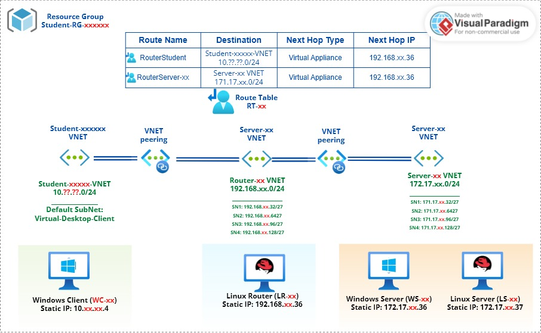

# Checkpoint4 Instructions & Submission Requirements

_This page only contains assignment instructions and submission requirements. Make sure to check Seneca Learning Portal: Blackboard for due dates_.

## Objectives

In this Checkpoint we will accomplish the following objectives:

- Review your understanding of Azure Virtual Networks
- Create the Router-XX and Server-XX virtual networks
- Peer all Vnets as described in the CP1 Diagram to allow connectivity between networks
- Create the Route Table RT-XX to allow traffic to be forwarded from the Student Vnet (Client) to the Server-XX Vnet (Servers) through the Router-XX Vnet (Router)
- Work with basic Azure CLI bash commands

## Part A - Creating Your Unique Network Topology





In this part of assignment, you ate asked to use this image as reference and re-draw it with your unique ID xx and your unique Student-xxxxxx Vnet.
- You may use any tool or application that allows you import Azure library of icons. Once you have Azure standard icons, you can draw this.
- I used [Visual Paradigm Online](https://online.visual-paradigm.com/) tool. Feel free to use same.

## Part B - Creating Resources in Azure Portal

### VNET Router-XX

```bash
# Remember to replace ‘XX’ with your Unique ID
Vnet Name:  Router-XX
IPv4 Address Space:  192.168.XX.0/24
Subnets:  Create 4
SN1:  192.168.XX.32/27
SN2:  192.168.XX.64/27
SN3:  192.168.XX.96/27
SN4:  192.168.XX.128/27
# Leave the Security Option and Tags at their defaults
```

### VNET Server-XX

```bash
# Remember to replace ‘XX’ with your Unique ID
Vnet Name:  Server-XX
IPv4 Address Space:  172.17.XX.0/24
Subnets:  Create 4
SN1:  172.17..XX.32/27
SN2:  172.17.XX.64/27
SN3:  172.17.XX.96/27
SN4:  172.17.XX.128/27
# Leave the Security Option and Tags at their defaults
```

### VNET Peerings

```bash
# Peer the Router Network to the Server Network
Peering Name:  RouterXX-ServerXX
Remote Peering Name:  ServerXX-RouterXX
# Leave all other settings at their defaults

# Peer the Router Network to the Student Network
Peering Name:  RouterXX-Student??????
Remote Peering Name:  Student??????-RouterXX
# Leave all other settings at their defaults
```

### Route Table

```bash
Route Table Name:  RT-XX
# Set Propagate Gateway Routes to ‘No’
# Leave Tags settings at their defaults
```

### Route Associations

In Complete below steps. **All four steps must be done, if you miss to associate, your setup would not work**

1. Add a route that points to the first subnet of the Server VNET with a next hop going to a ‘Virtual Appliance with an `IP 192.168.XX.36` (The first assignable host in your `Router-XX Vnet`)
2. Add a route that points to the first subnet (there may be only one) of the Student-?????? Vnet with a next hop going to a _Virtual Appliance_ with an `IP 192.168.XX.36` (The first assignable host in your `Router-XX Vnet`)
3. Associate this route table with the first subnet of your Server-XX Vnet
4. Associate this route table with the first subnet of the Student-?????? Vnet

## Part C - Working in Azure CLI Bash
Refer to [./startercode/README.md](./startercode/README.md) for tips on how to get started in bash and how ot work with basic commands that help you list `VNET` resources and configurations. For this assignment, you will use `az list` and `az show` commands to prove that you have successfully completed the above steps.

It is recommended that you complete below steps from you **Azure Portal CLI Interface**, but in order to do this, you need to clone and sync-up your GitHub **CSN400-Capstone** repo in Azure Portal CLI Interface. Follow the instruction in [./startercode/GitHubAuth.md](./startercode/GitHubAuth.md) to configure your Azure Portal CLI for SSH Authentication with gitHub.

Complete below steps in the same order as pr below. Make sure you are working in your `Checkpoint4` folder as all files must be in your `Checkpoint4` folder:

1. List all VNETs using `az network vnet list` command and send the output in `json` format to `vnet_list.json`file
2. Get the details of your `default student VNET` using `az show` command and send the output in `json` format to `student_vnet.json` file
3. List all peerings using `az peering peering list` command and send the output in `table` format to `peerings.tbl`file
4. Get the details of your `Router-XX` subnet `SN1` using `az show` command in `json` format and `query` it for details of subnet and rout associations. Only submit the specific property you are asked for. You will need to embed this in your `README.md` as per instructions **This one is not easy** :sunny:
5. List all routes in `RT-xx` using `az network route-table route list` command and send the output in `table` format to `route_list.tbl`file
6. Get the details of route between your `Router-xx SN1` and `Server-xx SN` using `az network route-table route show` and send the output in `json` format to `route_details.json`
7. (Optional) What CLI command will show you which subnet is associated to which route in toute table? _(Hint: maybe start with 'az network vnet subnet show`)_


## Part D - Network Review Questions

Answer below question in your report `CP4-student number.pdf`. Your answers can be one-two paragraphs. Try to elaborate but remain brief and to the point. **If you copy answers from internet or other students your mark for this assignment would be zero.**

1. What is Azure Virtual Network (VNET)? Elaborate in your own words, you may use diagrams if drawn by yourself.
2. In the context of Hybrid Cloud architecture. How on-prem computers can access resources inside Azure virtual network?
3. What are the most important benefits of Azure Virtual Networks? Elaborate in your own words. Do not copy/paste from Azure Documentation. Itemized list of just benefit without proper elaboration will not receive any marks
4. What is the difference between Network Security Group (NSG) and Route-Tables?
5. What is the difference between NSG and Firewalls?
6. What is a hob-and-spoc network topology and how be deployed in Azure Cloud?
7. In working with Azure VNETs, do you need o to define gateways for Azure to route traffic between subnets?
8. When do you need to configure and use Virtual Network Gateways?

## GitHub Submission Instructions
In your "CSN400-Capstone" repository make a directory `Checkpoint4`. In this directory create a file `README.me`. **Do not to copy / paste content from Instruction in your `README.md`**. This work must be your authentic genuine work. You may use other resources as reference, but `README.md` that will be considered for your marking must be your genuine authentic work.

```markdown
Add below lines to `README.md` and update with your details

# Checkpoint4 Submission

- **COURSE INFORMATION: xxx**
- **STUDENT’S NAME: xxx**
- **STUDENT'S NUMBER: xxx**
- **GITHUB USER ID: xxx**
- **TEACHER’S NAME: xxx**

Add a table of contents sections with headers showing your specific headers 
### Table of Contents
1. [Part A - Creating Your Unique Network Topology](#header1)
2. [Part B - Creating Resources in Azure Portal](#header2)
3. [Part C - Working in Azure CLI Bash](#header3)

You must then add below content into your `README.md`:

1. Part A - Creating Your Unique Network Topology: Include in your `README.md` the network diagram, updated with your unique ID, and Student Vnet
2. Part B - Creating Resources in Azure Portal: You do not need to submit anything for this part!
3. Part C - Working in Azure CLI Bash: Links to all files you created in Part C - Working in Azure CLI Bash.
5. Part D - Network Review Questions: check blackboard portal submission for this part. You do not need to submit it in GitHub 
```

**Take note:**

- You are not allowed to work from remote though browser or from local. You must use local repo in your laptop and azure.You can use any IDE of your choice, though the preferred option in this course is Microsoft VS Code.
- Build the habit of continuous, gradual and small updates with multiple `add` , `commit` , `push`. If a single commit has large volume of text and code added to your repository, it will raise the question of the source of the work. This exercise must have at least 6 commits.


## Blackboard Submission Instructions
You need to submit two files in Blackboard:
1. Your `README.md` file
2. A single pdf file with title `CP4-student number.pdf`. If your file is not `.pdf` I will not mark it

In your 'pdf' file include below information:
1. A link to your GitHub repository root folder
2. A link to your `Checkpoint4` folder that contains your `README.md` and other files
3. A screenshot of your `Checkpoint4/README.md` commit history
4. Details of your last commit number to `Checkpoint4/README.md`
5. Log record of your last commit from local repository using `git log -n 1` command
6. Answers to Part D - Network Review Questions

**Take note:**

- Your report file format and naming must follow above instruction, **no marks** will be given to submissions that do not follow the above instructions.
- Do not copy anything from the course notes or references in your submission. What you submit must be your authentic work, even if it is brief. A zero mark will be given to works that are copied from other people's work, and you will be reported to academic misconduct committee for further actions.
- [Seneca’s Copyright Policy](#seneca’s-copyright-policy) applies to all the content you create and all the material provided to you throughout the course.

---
### Useful Links

- [What is Azure Virtual Network?](https://learn.microsoft.com/en-us/azure/virtual-network/virtual-networks-overview)
- [Quickstart for Bash in Azure Cloud Shell](https://docs.microsoft.com/en-us/azure/cloud-shell/quickstart)
- [Commands Reference](https://docs.microsoft.com/en-us/cli/azure/reference-index?view=azure-cli-latest)
- [How to use Azure CLI effectively](https://docs.microsoft.com/en-us/cli/azure/use-cli-effectively)
- [How to query Azure CLI command output using a JMESPath query](https://docs.microsoft.com/en-us/cli/azure/query-azure-cli?tabs=concepts%2Cbash)


---
### Seneca’s Copyright Policy

> Most of the materials posted in this course are protected by copyright. It is a violation of Canada's Copyright Act and [Seneca's Copyright Policy](https://www.senecacollege.ca/about/policies/copyright-policy.html) to share, post, and/or upload course material in part or in whole without the permission of the copyright owner. This includes posting materials to third-party file-sharing sites such as assignment-sharing or homework help sites. Course material includes teaching material, assignment questions, tests, and presentations created by faculty, other members of the Seneca community, or other copyright owners.

> It is also prohibited to reproduce or post to a third-party commercial website work that is either your own work or the work of someone else, including (but not limited to) assignments, tests, exams, group work projects, etc. This explicit or implied intent to help others may constitute a violation of [Seneca’s Academic Integrity Policy](https://www.senecacollege.ca/about/policies/academic-integrity-policy.html) and potentially involve such violations as cheating, plagiarism, contract cheating, etc.  

> These prohibitions remain in effect both during a student’s enrollment at the college as well as withdrawal or graduation from Seneca.
